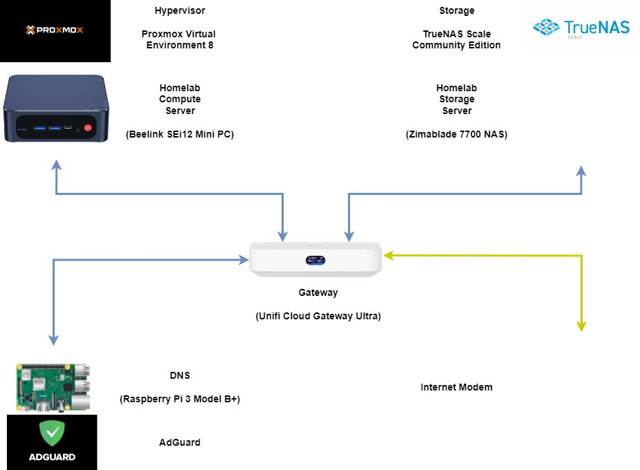
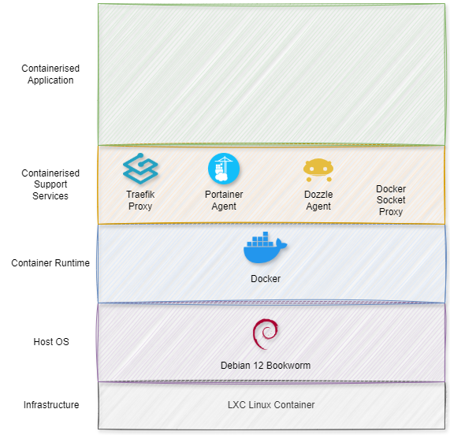
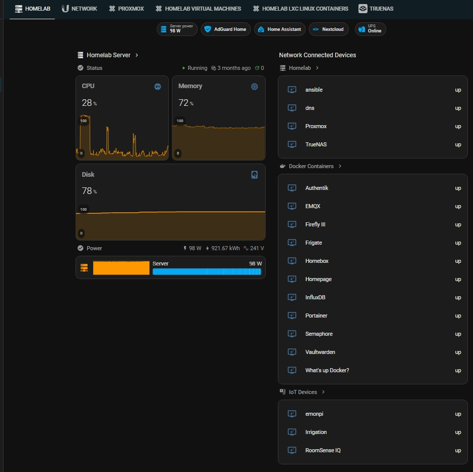
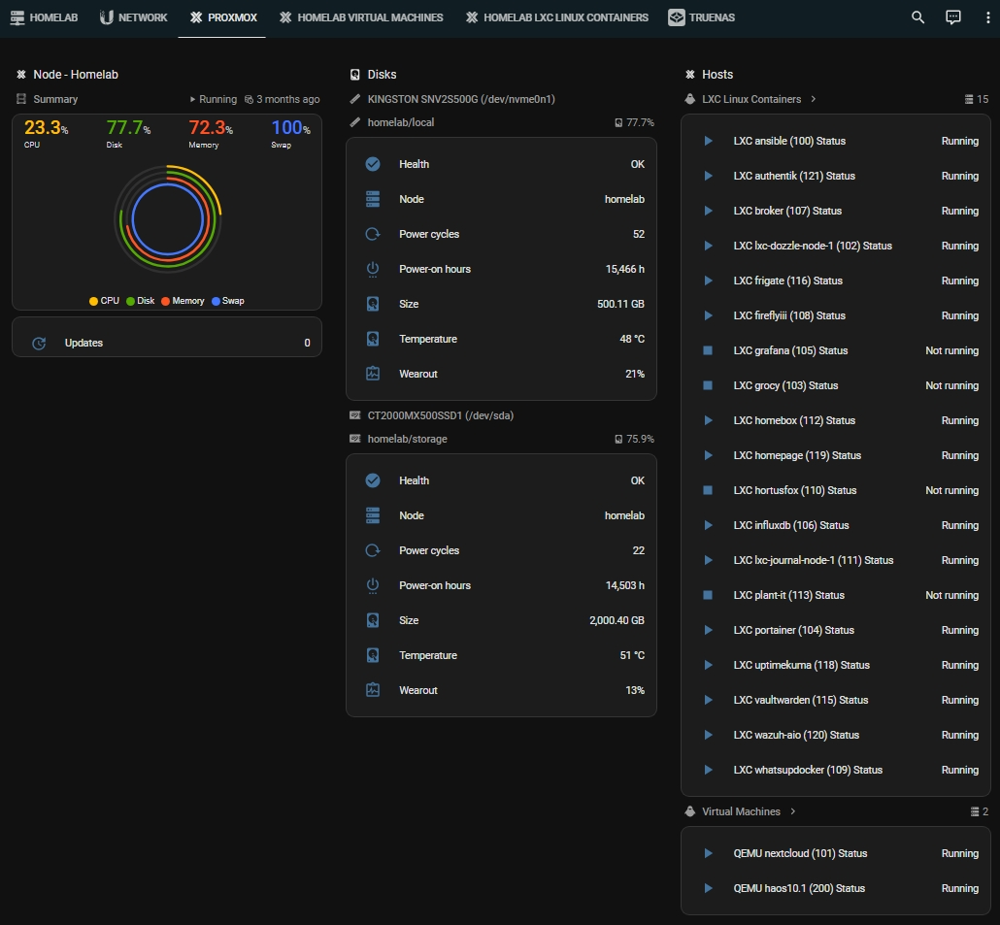
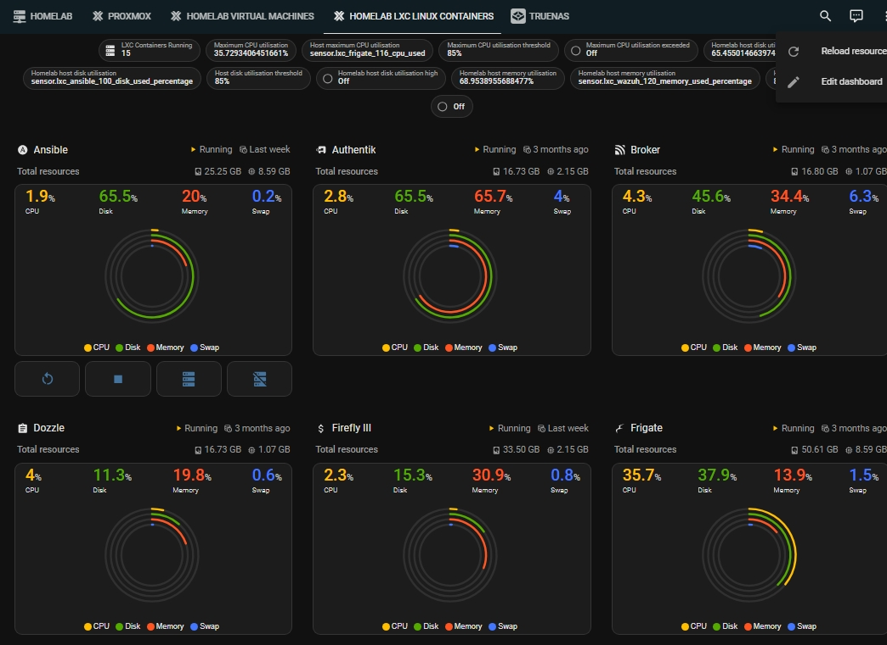

# Homelab

<!-- START doctoc generated TOC please keep comment here to allow auto update -->
<!-- DON'T EDIT THIS SECTION, INSTEAD RE-RUN doctoc TO UPDATE -->

- [Introduction](#introduction)
- [A Homelab](#a-homelab)
- [Hardware](#hardware)
  - [Network Hardware](#network-hardware)
  - [Compute Server Hardware](#compute-server-hardware)
  - [Storage Server Hardware](#storage-server-hardware)
- [Software](#software)
  - [Compute Server Software](#compute-server-software)
  - [Storage Server Software](#storage-server-software)
  - [Homelab Applications and Services](#homelab-applications-and-services)
- [Provisioning](#provisioning)
  - [Network Infrastucutre](#network-infrastucutre)
  - [Ansible](#ansible)
    - [Ansible linting](#ansible-linting)
    - [Ansible naming conventions](#ansible-naming-conventions)
  - [Semaphore UI](#semaphore-ui)
  - [Nextcloud](#nextcloud)
- [Monitoring and Alerting](#monitoring-and-alerting)
  - [Monitoring Tools](#monitoring-tools)
  - [Monitoring System](#monitoring-system)
  - [Automation](#automation)
- [Maintenance](#maintenance)
  - [Renovate](#renovate)
  - [Automation via Semaphore UI](#automation-via-semaphore-ui)
  - [Source code quality and security](#source-code-quality-and-security)
  - [Secrets management](#secrets-management)
- [Backup Strategy](#backup-strategy)
  - [Container configuration](#container-configuration)
  - [Container data](#container-data)
    - [Docker volume backup](#docker-volume-backup)
    - [Database volume backup](#database-volume-backup)
    - [Off-Site backup](#off-site-backup)
    - [Nextcloud AOI Backup](#nextcloud-aoi-backup)
- [Security](#security)
- [Documentation](#documentation)
  - [Markdown](#markdown)
- [Still to do](#still-to-do)

<!-- END doctoc generated TOC please keep comment here to allow auto update -->

## Introduction

Welcome to my Homelab definition-in-code! The repository consists largely of Ansible code which is used to provision and maintain the services which make up the functionality within my Homelab.

Please feel free to reuse any of the code or provide feedback and suggestions.

## A Homelab

A Homelab is many things to many people, but I use it primarily to

- self host capabilities that I want to run locally, without exposing data outside my home

- develop skills and knowledge around [cloud native technologies][cncf]

- exploring different technologies and how they can be used to enhance my home

- enjoy building something I use everyday

Some good sources of information about what a Homelab is include:

- [What is a HomeLab and How Do I Get Started?][youtube_whatisahomelab]

- [How to start your HomeLab journey?][youtube_homelabjourney]

- MORE TO COME!!

[cncf]: https://www.cncf.io
[youtube_whatisahomelab]: https://www.youtube.com/watch?v=gPGf4Y8nQqM
[youtube_homelabjourney]: https://www.youtube.com/watch?v=3-Nm15utD3g

In addition, sources of information about setting up a Homelab include:

- [Top 5 Mistakes HomeLabs Make (watch before you start)][youtube_mistakeshomelab]

- MORE TO COME!!

[youtube_mistakeshomelab]: https://www.youtube.com/watch?v=8B1Kp_ylUSY

## Hardware

The major hardware compoenents which makes up the Homelab are shown in the following diagram.



### Network Hardware

A [Ubiquity Cloud Gateway (UCG) Ultra][network] is used to create and manage the primary network aspects of the Homelab.

The UCG runs UniFi OS as the operating system which hosts the [Unifi Network Application][unifi].

Some good sources of information for setting up a Unifi network include:

- [Full Unifi Config - Setup from Start to Finish][youtube_unififullconfig]
- [COMPLETE UniFi Network Setup Guide (Detailed for Beginners)][youtube_unifisetup]

In addition, a Raspberry Pi 3 Model B+ single board computer, running Rasbian  Bullseye, is used to host an instance of [AdGuard Home][adguard], to provide a local DNS service.

All hosts within the Homelab are configured automatically by the Gateway, to use the DNS capability within AdGuard Home to resolve hostnames internal to the Homelab.

I wrote an article about using AdGuard Home as a DNS service which is [available on Medium][medium_dns].

[medium_dns]: https://medium.com/@greenthegarden/home-network-dns-configuration-8d6174492dd9

In addition, [Chrony][chrony], an implementation of the Network Time Protocol, is deployed on the Raspberry Pi as a local time server.
All network devices, utilise this time server, ensuring time synchronisation, without having to reach out to the internet.

Given the importance of the time service, it is deployed as a [Docker container][chronyd], orchestrated via
[Hashicorp Nomad][hashicorp-nomad]. Details of the deployment are [documented here](nomad/README.md).

[hashicorp-nomad]: https://www.nomadproject.io/
[chrony]: https://chrony-project.org/
[chronyd]: https://github.com/dockur/chrony

### Compute Server Hardware

A [Beelink SEi12 i5-1235U Intel 12 Gen Mini PC][compserv] was selected as the Homelab compute server.

The system uses an i5-1235U processor, which with 10 cores, provides a good amount of parallel processing in a relatviely efficient, compact, unit.

Server Specifications

| Component | Details                                                                                    |
| --------- | ------------------------------------------------------------------------------------------ |
| CPU       | Intel Core i5-1235U 2P-8E-12H 3.3-4.4GHz / 15-55 W TDP / 10 nm (Intel 7)                   |
| GPU       | Intel Xe / 80 EU / 1200 MHz                                                                |
| RAM       | 64GB DDR4 3200MHz max which is fullyu utilised by 2x Crucial 32GB SODIMM modules           |
| Storage   | 500GB M.2 2280 NVMe plus 2TB SATA 3 2.5″ SSD                                               |
| Network   | 1x Gigabit Ethernet (Realtek)                                                              |
| Ports     | 1x USB 3.1 Type-C (data) / 2x USB 3.0 / 2x USB 2.0 / 2x HDMI 2.1 / Audio Jack / BIOS Reset |

### Storage Server Hardware

A [ZimaBlade 7700 NAS kit][storserv], which uses a quad-core version of the ZimaBlade single-board x86 computer, is used as the storage server.

Server Specifications

| Component | Details                                                  |
| --------- | -------------------------------------------------------- |
| CPU       | Intel® Celeron with 2.4 GHz Turbo Speed                  |
|           | Intel® AES New Instructions                              |
|           | Intel® Virtualization Technology (VT-x)                  |
|           | Intel® Virtualization Technology for Directed I/O (VT-d) |
| Memory    | 16 GB DDR3L RAM                                          |
| Storage   | Integrated 32 GB eMMC                                    |
| Network   | 1 x 10/100/1000 Mbps Gigabit Ethernet                    |
| PCIe      | 1 x PCIe 2.0, four lanes                                 |
| SATA      | 2 x SATA 3.0                                             |
| Power     | 45 W USB Type-C power adapter                            |
| Thermal   | 6 W TDP with passive cooling                             |

For storage, two Seagate Barracuda Green 2TB SATA hard drives are used.

## Software

### Compute Server Software

The compute server is running [Proxmox Virtual Environment 8 hypervisor][compsoft] as the OS.
Proxmox supports both Virtual Machines and LXC Linux Containers to be used to host the services and applications.

Proxmox 8 was installed on top of Debian 12 as I was unable to boot the Compute Server directly into the Proxmox installer.

Some good sources of information for setting up Proxmox are:

ADD DETAILS!!

### Storage Server Software

The storage service is running [TrueNAS Scale Community Edition][storsoft] as the storage solution.

TrueNAS Scale ElectricEel-24.10.2 was installed directly on to the ZimBlade.

The initial configuration of TrueNAS was based on details described in [6 Crucial Settings to Enable on TrueNAS SCALE][truenassettings].

### Homelab Applications and Services

The majority of applications and services running within the Homelab are deployed as [Docker containers][docker], running within [LXC Linux containers][linuxcontainers].
The exceptions are Nextcloud and Home Assistant, which are running in virtual machines, and Wazuh is installed directly on an LXC Linux Container.

The Linux containers run [Debian 12 Bookworm][debian] as the host OS.

The following resource details are used for LXC Linux Containers:

Low resource services, those which are largely stateless:

| Resource  | Value                                                  |
| --------- | -------------------------------------------------------- |
| Memory    | 1.00 GiB (1024 MiB)                  |
| Swap      | 1.00 GiB (1024 MiB)                              |
| Cores     | 1                  |
| Disk size | 16GB |

Medium resource services, those which host datastores of some type:

| Resource  | Value                                                  |
| --------- | -------------------------------------------------------- |
| Memory    | 2.00 GiB (1024 MiB)                  |
| Swap      | 2.00 GiB (1024 MiB)                              |
| Cores     | 2                  |
| Disk size | 24GB |

Each application is hosted in a single LXC Linux Container, using an architecture as shown in the following diagram.



The current iteration of the Homelab hosts the following applications:

<!-- uses https://gist.github.com/stevecondylios/dcadb4fc73e63f27a3bbcf17e52058bf -->

-  [Nextcloud] - Open source content collaboration platform. <!-- markdownlint-disable MD033 --> <!-- markdownlint-disable MD013 -->
-  [Home Assistant][homeassistant] - Open source home automation that puts local control and privacy first. <!-- markdownlint-disable MD033 --> <!-- markdownlint-disable MD013 -->
-  [Authentik] - Identity manager. <!-- markdownlint-disable MD033 --> <!-- markdownlint-disable MD013 -->
-  [Dozzle] - Realtime log viewer for docker containers. <!-- markdownlint-disable MD033 --> <!-- markdownlint-disable MD013 -->
-  [EMQX] - MQTT platform. <!-- markdownlint-disable MD033 --> <!-- markdownlint-disable MD013 -->
-  [Firefly III][fireflyiii] - A free and open source personal finance manager. <!-- markdownlint-disable MD033 --> <!-- markdownlint-disable MD013 -->
-  [Frigate] - An open source NVR. <!-- markdownlint-disable MD033 --> <!-- markdownlint-disable MD013 -->
-  [Grafana] - An open source tool to create dashboards. - REPLACED BY DOZZLE <!-- markdownlint-disable MD033 --> <!-- markdownlint-disable MD013 -->
-  [Grocy] - An open source web-based self-hosted groceries & household management solution. <!-- markdownlint-disable MD033 --> <!-- markdownlint-disable MD013 -->
-  [Homebox] - An open source inventory and organization system. <!-- markdownlint-disable MD033 --> <!-- markdownlint-disable MD013 -->
-  [Homepage] - A modern, fully static, fast, secure fully proxied, highly customizable application dashboard. <!-- markdownlint-disable MD033 --> <!-- markdownlint-disable MD013 -->
-  [Hortusfox] - A free and open-sourced self-hosted plant manager system. <!-- markdownlint-disable MD033 --> <!-- markdownlint-disable MD013 -->
-  [InfluxDB] - A time-series database. <!-- markdownlint-disable MD033 --> <!-- markdownlint-disable MD013 -->
- 📓 [Journal] - A simple self-hosted journaling app.
-  [Portainer] - A universal container management platform. <!-- markdownlint-disable MD033 --> <!-- markdownlint-disable MD013 -->
-  [Semaphore] - User friendly web interface for executing Ansible playbooks, Terraform, OpenTofu code and Bash scripts. <!-- markdownlint-disable MD033 --> <!-- markdownlint-disable MD013 -->
-  [Uptime Kuma][uptimekuma] - An easy-to-use self-hosted monitoring tool. <!-- markdownlint-disable MD033 --> <!-- markdownlint-disable MD013 -->
-  [Vaultwarden] - An alternative server implementation of the Bitwarden Client API. <!-- markdownlint-disable MD033 --> <!-- markdownlint-disable MD013 -->
-  [WUD (What's up Docker)][wud] - A tool to keep Docker containers up-to-date. <!-- markdownlint-disable MD033 --> <!-- markdownlint-disable MD013 -->

Underpinning the applications are a number of support services:

- [Docker Socket Proxy][dockersocketproxy] - A security-enhanced proxy for the Docker socket.
- [Docker Volume Backup][dockervolumebackup] - Companion container to backup Docker volumes.
-  [Dozzle Agent][dozzleagent] - Provide a Dozzle Server instance access to external node resources. <!-- markdownlint-disable MD033 --> <!-- markdownlint-disable MD013 -->
-  [Portainer Agent][portaineragent] - Provide a Portainer Server instance access to external node resources. <!-- markdownlint-disable MD033 --> <!-- markdownlint-disable MD013 -->
- [Node Exporter][nodeexporter]- Prometheus exporter for hardware and OS metrics. - REPLACED BY DOZZLE
-  [Prometheus] - An open-source systems monitoring and alerting toolkit.  - REPLACED BY DOZZLE <!-- markdownlint-disable MD033 --> <!-- markdownlint-disable MD013 -->
-  [Traefik] - An open source application proxy. <!-- markdownlint-disable MD033 --> <!-- markdownlint-disable MD013 -->
-  [Wazuh Agent][wazuhagent] - Wazuh agent for endpoints. <!-- markdownlint-disable MD033 --> <!-- markdownlint-disable MD013 -->

## Provisioning

### Network Infrastucutre

TODO: Add details about setting up domain and DNS entries (Cloudflare, Letsencrypt, etc)

TODO: Include ways of testing DNS records, and what the outputs mean. For example,

```bash
nslookup <domain>
dig <domain>
```

### Ansible

[Ansible] is used to define and automate the configuration of the Linux containers, including the installation of Docker, and deployment of the containerised applications. The
Ansible files make up the majority of this repository, which is structured to work with [Semaphore UI][semaphoreui].

The adoption of Ansible allows the configuration to be defined in code, and therefore version controlled in a source code repository.

#### Ansible linting

All Ansible code is linted using [Ansible Lint][ansible-lint], using the configuration in [.ansible-lint.yaml](.ansible-lint.yaml).

[ansible-lint]: https://ansible.readthedocs.io/projects/lint/

#### Ansible naming conventions

The following [naming convention][ansiblenaming] is to be adopted within the repository:

- Playbooks: Use names like site.yml, webapp.yml, database.yml.

- Roles: Use lowercase letters and hyphens to separate words, e.g. web-server or database-backup.

- Task file names: Use lowercase letters and underscores, and end with .yml instead of .yaml.

- Task names: Start with a verb to indicate the action, e.g. "start_webserver".

- Variable names: Use lowercase letters and underscores to separate words.

TO DO: update code to align with naming convention

### Semaphore UI

[Semaphore UI][semaphore] is used to manage and run the various Ansible artifacts, including the inventories, and playbooks. All initial provisioning of the services within the Homelab
is  run from Semaphore. The history of all playbook runs is maintained within Semaphore UI in order to be able to monitor the the outcome of each run.

### Nextcloud

[Nextcloud][nextcloud] is deployed on to a Proxmox Virtual Machine using [Nextcloud AOI][nextcloud-aio]. Includes a `docker-compose.yaml` file, which is run using the following

```bash
docker compose up --detach
```

In addition, it is deployed behind an instance of Nginx Proxy Manager and DuckDNS to provide it with a valid certificate. A Portainer Agent instance is also deployed to manage containers.

[nextcloud-aio]: https://nextcloud.com/blog/how-to-install-the-nextcloud-all-in-one-on-linux/

The Portainer Agent is deployed using the following script.

```bash
docker run -d \
  -p 9001:9001 \
  --name portainer_agent \
  --restart=always  \
  -v /var/run/docker.sock:/var/run/docker.sock \
  -v /var/lib/docker/volumes:/var/lib/docker/volumes \
  -v /:/host \
  portainer/agent:2.32.0-alpine
```

<!-- The Nginx Proxy Manager is deployed using the following script.

```bash
docker run -d \
  --name nginx-proxy-manager \
  --env DISABLE_IPV6=true \
  --network=host \
  --restart=unless-stopped \
  -v /home/nextcloud/data:/data:rw \
  -v /home/nextcloud/letsencrypt:/etc/letsencrypt:rw \
  docker.io/jc21/nginx-proxy-manager:latest
``` -->

## Monitoring and Alerting

Monitoring is a key aspect of the Homelab I wanted to work on.

### Monitoring Tools

A number of different tools are utilised to support monitoring.

- Portainer, which provides a frontend to Docker to:

  - check the configuration and state of deployed containers.

  - cleanup artifacts (images, volumes) which are no longer being utilised.

  - check logs of individual containers.

- Dozzle, which provides a frontend to Docker hosts to:

  - visualise the state of multiple hosts.

  - check logs from multiple containers running on a host.

- Uptime Kuma, which provides a frontend to:

  - configure and monitor probes into different resource types, include host systems, Docker containers, and MQTT clients.

### Monitoring System

In terms of an overall monitoring and alerting system, [Home Assistant][home-assistant] is utilised, supported by the following integration,
which provide sensors to ingest data from various services and enable controlling of services:

- [AdGuard Home][adguardhome-integration]

- [Nextcloud][nextcloud-integration]

- [Proxmox][proxmox-custom-integration]

- [TrueNAS][truenas-integration]

- [UniFi Network][unifi-network-integration]

- [Uptime Kuma][uptime-kuma-integration]

Using Home Assistant has a number of advantages in my case:

- Provides an ability to manually monitor and control systems.

- Supports automating controls and alerts for systems.

- Provides a secure remote access mechanism via its [cloud offering][nabucasa].

[adguardhome-integration]: https://www.home-assistant.io/integrations/adguard
[home-assistant]: https://www.home-assistant.io/
[nabucasa]: https://www.nabucasa.com/
[nextcloud-integration]: https://www.home-assistant.io/integrations/nextcloud
[proxmox-custom-integration]: https://github.com/dougiteixeira/proxmoxve
[truenas-integration]: https://github.com/tomaae/homeassistant-truenas
[unifi-network-integration]: https://www.home-assistant.io/integrations/unifi
[uptime-kuma-integration]: https://github.com/meichthys/uptime_kuma

Current 'prototype' implementations of dashboards implemented within Home Assistant are shown in the following images.







### Automation

The [automation capability][home-assistant-automation] of Home Assistant is utilised to trigger [notifications][home-assistant-notification] or take automated actions to resolve issues.

For example:

- Notifications generated when hosts become unavailable from the network.

- Notifications generated when host resources (CPU, Disk and memory) exceed thresholds.

- Automating the restarting of resources which appear in an unstable state.

- Automating the shutdown and restart of systems to reduce power consumption.

[home-assistant-automation]: https://www.home-assistant.io/docs/automation/basics/
[home-assistant-notification]: https://www.home-assistant.io/integrations/notify/

## Maintenance

The intent is to automate as much of the maintenance of the Homelab as possible. Although tools such as [Watchtower][docker-watchtower] automate the updating of a running system,
my intention is to have the Ansible code as the source-of-truth, that the running system needs then to reflect, in the style of [GitOps][gitops].

[docker-watchtower]: https://containrrr.dev/watchtower/
[gitops]: https://www.gitops.tech/

### Renovate

The repository uses [Mend Renovate][mend-renovate], via the [Renovate Github App][github-app-renovate], to assist with maintaining versions defined within the source code.

At present Renovate is successfully automatically creating pull requests for updates to Ansible dependencies, however, I had hoped it would also update Docker image versions,
but have not seen this to occur.

The following are sources used to setup and configure Renovate:

- [Meet Renovate - Your Update Automation Bot for Kubernetes and More!][youtube_meetrenovate]
- [Renovate bot cheat sheet – the 11 most useful customizations][renbotcs]

[mend-renovate]: https://www.mend.io/mend-renovate/
[github-app-renovate]: https://github.com/marketplace/renovate
[renbotcs]: https://www.augmentedmind.de/2023/07/30/renovate-bot-cheat-sheet/
[youtube_meetrenovate]: https://www.youtube.com/watch?v=3ZxnCtQ31ew

### Automation via Semaphore UI

A major benefit for the adoption of Semaphore UI to manage Ansible is the capability to be able to [schedule the running of Ansible playbooks][semaphore-ui-schedule].

For example, an automation is configured to run daily updates of the host systems, using the [hosts-update.yaml playbook](playbooks/hosts-update.yaml).

[semaphore-ui-schedule]: https://docs.semaphoreui.com/user-guide/schedules/

### Source code quality and security

[Pre-commit][pre-commit] is utilised to automate the running of tools to ensure code quality and security is maintained before any code changes are committed to the source code.
The tools run are configured within the [.pre-commit-config.yaml](.pre-commit-config.yaml) file.

[pre-commit]: https://pre-commit.com/

### Secrets management

All secrets, such as passwords, tokens and personal identifiers, are maintained within the code base using [ansible-vault][ansible-vault] functionality to ensure they are encrypted
 and not exposed in plain text. In addition, tools are run by pre-commit, to ensure the encrypted files are in an encrypted state before committing to source code,
 and all files are scanned for passwords and tokens.

[ansible-vault]: https://docs.ansible.com/ansible/latest/cli/ansible-vault.html

## Backup Strategy

A critical aspect of the Homelab is having a robust capability to ensure all data is being regularly backed-up. A number of different approaches are used to support the
different services running in the Homelab.

### Container configuration

All configuration for the Homelab is maintained in this version controlled repository so is not separately backed up.

The majority of the services are configured at runtime using either environment variables or labels. Writing configuration,
or .env, files to the file system is kept to a minimum.

### Container data

All containers which persist data use [Docker Volumes][dv] as data stores, rather than bind mounting directly to the file system.

In order to backup the volumes, the service [docker-volume-backup][dvb] is utilised. The approach
offers a lightweight containerised solution which can backup locally, to shared volumes, or cloud.

The configuration for docker-volume-backup is managed via the [templated .env file](/playbooks/templates/docker-volume-backup/docker-volume-backup.env.j2),
which is derived from [docker-volume-backup Configuration reference][dvbcr].

A local copy of the data is retained, as well as a copy pushed to the Storage server, via ssh. The data is encrypted via GPG.
Pruning of the backups also is enabled, to ensure only 7 days of backups are retained. Backups are initiated `@daily` which
occurs at midnight.

#### Docker volume backup

For services which store data outside of a dedicated database, the associated data volume is mounted into the docker-volume-backup container.

An example of how this is achieved, taken from the [deploy-homebox playbook](playbooks/deploy-homebox.yaml), is shown below.

```yaml
- name: Deploy a containerised instance of Docker Volume Backup
  ansible.builtin.include_tasks:
    file: tasks/deploy-docker-volume-backup.yaml
  vars:
    docker_volume_backup_volume_to_backup:
        - "{{ homebox_volume_name }}:/backup/homebox-backup:ro"
    docker_volume_backup_backup_label: "{{ homebox_service_name }}"
```

A label is added to the associated container, to ensure the container is stopped before the data volume is backed up. An
example of this, taken from [deploy-homebox task](playbooks/tasks/deploy-homebox.yaml), is shown below.

```yaml
- name: Create Homebox container labels
  ansible.builtin.set_fact:
    homebox_container_labels: "{{ homebox_container_labels | default({}) | combine({item.key: item.value}) }}"
  with_items:
    ...
    # Docker Volume Backup labels
    - { "key": "docker-volume-backup.stop-during-backup", "value": "true" }
    ...
```

#### Database volume backup

For services which store data in a dedicated database container, the database contents are dumped to a file, which
is then backed up.

For MariaDB databases, the backup is achieved using `mariadb-dump`, an example of which, taken from
[deploy-hortusfox task](/playbooks/tasks/deploy-hortusfox.yaml), is shown below.

```yaml
- name: Create Hortusfox DB container labels
  ansible.builtin.set_fact:
    hortusfox_db_container_labels: "{{ hortusfox_db_container_labels | default({}) | combine({item.key: item.value}) }}"
  with_items:
    # Docker Volume Backup labels
    - {
      "key": "docker-volume-backup.archive-pre",
      "value": "/bin/sh -c 'mariadb-dump --single-transaction --user={{ hortusfox.db_user }} -p{{ hortusfox.db_password }} --all-databases > /tmp/dumps/dump.sql'"
    }
```

In addition, a dedicated volume is created to store the backup file, an example of which, taken from
[deploy-hortusfox task](/playbooks/tasks/deploy-hortusfox.yaml), is shown below.

```yaml
- name: Create Hortusfox backup volume  # noqa: syntax-check[unknown-module]
  community.docker.docker_volume:
    name: "{{ hortusfox_db_backup_volume_name }}"
    state: present
```

Within the associated deployment of the database service, the volume is mounted into the container, an example of which,
taken from [hortusfox/docker-compose.yml](/playbooks/templates/hortusfox/docker-compose.yml.j2), is shown below.

```yaml
  db:
    container_name: hortusfox_db
    image: mariadb:lts
    environment:
      MYSQL_ROOT_PASSWORD: {{ hortusfox.db_root_password | default('dummy') }}
      MYSQL_DATABASE: {{ hortusfox.db_database | default('hortusfox') }}
      MYSQL_USER: {{ hortusfox.db_user | default('hortusfox') }}
      MYSQL_PASSWORD: {{ hortusfox.db_password | default('dummy') }}
    hostname: db
    labels: {{ (hortusfox_db_container_labels | default({})) | default(omit) }}
    networks:
      - hortusfox
    restart: always
    volumes:
      - db_data:/var/lib/mysql
      - {{ hortusfox_db_backup_volume_name | default('hortusfox_db_backup') }}:/tmp/dumps
```

In the case where docker-compose is used to deploy the containers, the volume needs to assigned as `external`, an example of which,
taken from [hortusfox/docker-compose.yml](/playbooks/templates/hortusfox/docker-compose.yml.j2),
is shown below.

```yaml
volumes:

  db_data:
  {{ hortusfox_db_backup_volume_name | default('hortusfox_db_backup') }}:
    external: true
  app_images:
  app_logs:
  app_backup:
  app_themes:
  app_migrate:
```

As volume must also be mounted to the docker-volume-backup container, an example of which, taken from
[deploy-hortusfox.yaml playbook](/playbooks/deploy-hortusfox.yaml), is shown below.

```yaml
- name: Deploy a containerised instance of Docker Volume Backup
  ansible.builtin.include_tasks:
    file: tasks/deploy-docker-volume-backup.yaml
  vars:
    docker_volume_backup_volume_to_backup:
      - "{{ hortusfox_db_backup_volume_name }}:/backup/hortusfox_db-backup:ro"
    docker_volume_backup_backup_label: "{{ hortusfox_service_name }}-db"
```

TO DO: I could not get the database backups to work using docker-socket-proxy and had to bind to the docker socket directly.

#### Off-Site backup

For off-site backup, a `Cloud Sync Task` is configured within the Storage server to push the backup files created by
docker-volume-backup to a cloud storage provider. The task is scheduled to be run daily at 1am.

#### Nextcloud AOI Backup

Nextcloud AOI (All in One) uses BorgBackup to manage backups.

An issue with the way the back up location is configured is that it cannot easily be changed once it is initially set.
A way to manage this is described in the [Github project page][nxtcldaio] using the following to be able to have the
`Reset backup location` button show in the AIO Interface.

```bash
root@nextcloud:~# docker exec nextcloud-aio-mastercontainer rm /mnt/docker-aio-config/data/borg.config
```

## Security

The following services are used to monitor security of the system.

-  [Wazuh][wazuh] - A free and open-source platform for threat prevention, detection, and response, capable of protecting workloads across on-premises, virtualized, containerized, and cloud-based environments. <!-- markdownlint-disable MD033 --> <!-- markdownlint-disable MD013 -->

Wazuh is installed across all the hosts via Ansible using a [forked version of the official Wazuh playbook][github-wazuh].

[github-wazuh]: https://github.com/greenthegarden/wazuh-ansible

## Documentation

### Markdown

All documentation is written in Markdown, using the [Markdown Guide][markdownguide] as a reference, and linted, using [markdownlint-cli2][markdownlint].
The configuration for markdownlint is defined in [.markdownlint.yaml](.markdownlint.yaml).

## Still to do

- Explore using an Proxmox network for Proxmox nodes, rather than having them on main network.

[adguard]: https://adguard.com/en/adguard-home/overview.html
[ansible]: https://docs.ansible.com/ansible/latest/index.html
[ansiblenaming]: https://www.techchorus.net/posts/ansible-naming-conventions/
[authentik]: https://goauthentik.io/
[compserv]: https://www.bee-link.com/beelink-minipc-intel-i5-12-gen-sei1235u
[compsoft]: https://www.proxmox.com/en/products/proxmox-virtual-environment/overview
[debian]: https://www.debian.org/
[docker]: https://www.docker.com/
[dockersocketproxy]: https://github.com/Tecnativa/docker-socket-proxy
[dockervolumebackup]: https://github.com/offen/docker-volume-backup
[dozzle]: https://dozzle.dev/
[dozzleagent]: https://dozzle.dev/guide/agent
[dv]: https://docs.docker.com/engine/storage/volumes/
[dvb]: https://github.com/offen/docker-volume-backup "docker-volume-backup"
[dvbcr]: https://offen.github.io/docker-volume-backup/reference/
[emqx]: https://www.emqx.com/en
[fireflyiii]: https://www.firefly-iii.org/
[frigate]: https://frigate.video/
[grafana]: https://grafana.com/
[grocy]: https://grocy.info/
[homeassistant]: https://www.home-assistant.io/
[homebox]: https://homebox.software/en/
[homepage]: https://gethomepage.dev/
[hortusfox]: https://www.hortusfox.com/
[influxdb]: https://www.influxdata.com/
[journal]: https://github.com/inoda/journal
[linuxcontainers]: https://linuxcontainers.org/
[markdownguide]: https://www.markdownguide.org/
[markdownlint]: https://github.com/DavidAnson/markdownlint-cli2
[network]: https://techspecs.ui.com/unifi/unifi-cloud-gateways/ucg-ultra
[nextcloud]: https://nextcloud.com/
[nodeexporter]: https://github.com/prometheus/node_exporter
[nxtcldaio]: https://github.com/nextcloud/all-in-one/discussions/596
[portainer]: https://www.portainer.io/
[portaineragent]: https://docs.portainer.io/admin/environments/add/docker/agent
[prometheus]: https://prometheus.io/
[semaphore]: https://semaphoreui.com/
[semaphoreui]: https://semaphoreui.com/
[storserv]: https://www.crowdsupply.com/icewhale-technology/zimablade
[storsoft]: https://www.truenas.com/truenas-community-edition/
[traefik]: https://doc.traefik.io/traefik/
[truenassettings]: https://www.youtube.com/watch?v=dP0wagQVctc "6 Crucial Settings to Enable on TrueNAS SCALE"
[unifi]: https://help.ui.com/hc/en-us/articles/360012192813-Introduction-to-UniFi
[uptimekuma]: https://github.com/louislam/uptime-kuma
[youtube_unififullconfig]: https://www.youtube.com/watch?v=pbgM6Cyh_BY
[youtube_unifisetup]: https://www.youtube.com/watch?v=3ZxnCtQ31ew
[vaultwarden]: https://github.com/dani-garcia/vaultwarden
[wazuh]: https://wazuh.com/
[wazuhagent]: https://github.com/wazuh/wazuh-agent
[wud]: https://getwud.github.io/wud/#/
