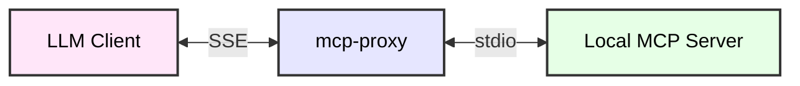

# Using AI in the Homelab

<!-- START doctoc generated TOC please keep comment here to allow auto update -->
<!-- DON'T EDIT THIS SECTION, INSTEAD RE-RUN doctoc TO UPDATE -->
**Table of Contents**  *generated with [DocToc](https://github.com/thlorenz/doctoc)*

- [Components](#components)
- [Ollama Requires a Bridge](#ollama-requires-a-bridge)
  - [Add Tools to Open WebUI](#add-tools-to-open-webui)
  - [Enable Tools in Models](#enable-tools-in-models)
- [Integration with Applications](#integration-with-applications)
  - [Tududi](#tududi)
  - [AFFiNe](#affine)
  - [Home Assistant](#home-assistant)
  - [Connecting via Open WebUI](#connecting-via-open-webui)

<!-- END doctoc generated TOC please keep comment here to allow auto update -->

## Components

- [Ollama](https://github.com/ollama/ollama): Large Language Model (LLM) runner
- [Open WebUI](https://github.com/open-webui/open-webui): Interface to Ollama and OpenAI API
- [SearXNG](https://github.com/searxng/searxng): Internet metasearch engine which aggregates results from various search services and databases.
- [n8n](https://github.com/n8n-io/n8n): Workflow automation platform with native AI capabilities

## Ollama Requires a Bridge

MCPO (MCP-to-OpenAPI Proxy) is an official Open WebUI tool that bridges local Model Context Protocol
(MCP) servers with HTTP interfaces. It converts standard MCP tools into RESTful OpenAPI-compliant
HTTP endpoints, allowing your self-hosted AI models to securely run local tasks.

A bridge between Streamable HTTP and stdio MCP transports - [mcp-proxy][mcp-proxy]

[mcp-proxy]: https://github.com/sparfenyuk/mcp-proxy



A simple, secure MCP-to-OpenAPI proxy server - [mcpo][mcpo]

[mcpo]: https://github.com/open-webui/mcpo

```bash
docker run --name mcpo -p 8000:8000 -v /root/mcpo/config.json:/app/config.json:ro ghcr.io/open-webui/mcpo:main --root-path "/" --config /app/config.json --hot-reload
```

If you run it locally, it requires a config.json file in the same format as Claude Desktop.

Example config.json

```json
{
  "mcpServers": {
    "memory": {
      "command": "npx",
      "args": ["-y", "@modelcontextprotocol/server-memory"]
    },
    "time": {
      "command": "uvx",
      "args": ["mcp-server-time", "--local-timezone=America/New_York"],
      "disabledTools": ["convert_time"]
    }
  }
}
```

Can test within a browser at

- memory-tool: [http://localhost:8000/memory/docs](http://localhost:8000/memory/docs)
- time-tool: [time-tool](http://localhost:8000/time/docs)

### Add Tools to Open WebUI

Go to Settings -> Integrations -> Manage Tool Servers.

Click the + (Add) button.

Set the Type to OpenAPI/MCP, enter your MCPO server URL (e.g., [http://host.docker.internal:8000](http://host.docker.internal:8000)), and save

### Enable Tools in Models

Navigate to Workspace > Models and edit your preferred model (click the edit icon).

Scroll to the Tools section and check the MCP tools you want the model to access.

Scroll to Advanced Parameters and change Function Calling to Native for better tool reliability

## Integration with Applications

Certain applications incorporate MCP Server instance which the AI components can interact with to.

### Tududi

Has built in MCP Server

### AFFiNe

[Model Context Protocol server for AFFiNE][affine-mcp-server]

[affine-mcp-server]: https://github.com/DAWNCR0W/affine-mcp-server

### Home Assistant

[The Unofficial and Awesome Home Assistant MCP Server][ha-mcp]

[ha-mcp]: https://github.com/homeassistant-ai/ha-mcp

```bash
docker run -d \
  --name ha-mcp \
  -p 8086:8086 \
  -e HOMEASSISTANT_URL="http://homeassistant.localdomain" \
  -e HOMEASSISTANT_TOKEN="<token>" \
  ghcr.io/homeassistant-ai/ha-mcp:latest ha-mcp-web
```

### Connecting via Open WebUI

Open WebUI Configuration

- Navigate to Admin Panel → Settings → Integrations → Manage Tool Servers
  - Note: There is also "External Tools" in user settings — use the Admin one here
- Click + (Add Server)
- Enter:
  - Type: MCP Streamable HTTP
  - Name: Home Assistant
  - ID: auto
  - Server URL: {{MCP_SERVER_URL}}
  - Auth: (configure if needed)
- Click Save

Common patterns for determining the URL:

- Docker HA on same host: [http://host.docker.internal:8086/mcp](http://host.docker.internal:8086/mcp)
- Local network: [http://lxc-controller.localdomain:8086/mcp](http://lxc-controller.localdomain:8086/mcp)
- Cloudflare tunnel: [https://your-tunnel.trycloudflare.com/secret_abc123](https://your-tunnel.trycloudflare.com/secret_abc123)

For stdio-based servers, use mcpo proxy to bridge stdio to HTTP.
